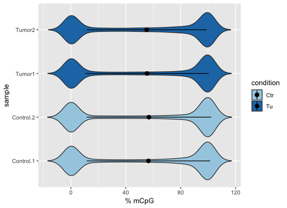

# Biomedical Data Science School
## Day 2 Part 2: RRBS-Data

Edinburgh, MRC Institute of Genetics and Molecular Medicine
Tuesday, 12th March


If you haven’t installed the packages that we need to run this tutorial you will need to do so now. 


```{r Packages, eval = FALSE, message=FALSE}

if (!requireNamespace("BiocManager", quietly = TRUE))
    install.packages("BiocManager")
BiocManager::install("knitr")
BiocManager::install('TxDb.Mmusculus.UCSC.mm10.knownGene')
BiocManager::install('methylKit')
BiocManager::install('genomation')
BiocManager::install('ggplot2')
BiocManager::install("AnnotationHub")
BiocManager::install("annotatr")
BiocManager::install("bsseq")
BiocManager::install("DSS")
```

Check that all packages can be loaded:

Documentation packages:
```{r libraries1, eval = TRUE, messgae=FALSE, results=FALSE, cache=FALSE}
library("knitr")
```

Analysis packages:
```{r libraries3, eval = TRUE, messgae=FALSE, results=FALSE, cache=FALSE}
library("methylKit")
library("bsseq")
library("DSS")
```


Annotation packages:
```{r libraries2, eval = TRUE, messgae=FALSE, results=FALSE, cache=FALSE}
library('TxDb.Mmusculus.UCSC.mm10.knownGene')
library("AnnotationHub")
library("annotatr")
library("genomation")
```


Visualisation packages:
```{r libraries4, eval = TRUE, messgae=FALSE, results=FALSE, cache=FALSE}
library("ggplot2")
```


## RRBS Single CpG Analysis using methylKit
 

### Loading the data into R

We will start with an analysis of a small data set comprising 4 samples, two control samples and two tumor samples. The aim is to find methylation differences. I'm providing the coverage files which are outputs from `Bismark methylation extractor tool (v0.18.1)` filtered for chromosome 11. The .cov files contain the following information:
chromosome, start position, end position, methylation percentage, count methylated, count unmethylated. 

For example:

```{bash}
head Data/RRBS/chr11.RRBS_B372.cov
```

To read the data into R we will first use the `MethylKit` package:
```{r}

file.list <- list("Data/RRBS/chr11.RRBS_B372.cov",
                  "Data/RRBS/chr11.RRBS_B436.cov",
                  "Data/RRBS/chr11.RRBS_B098.cov",
                  "Data/RRBS/chr11.RRBS_B371.cov")


    sample.ids = list("Control.1", "Control.2","Tumor1","Tumor2")
    treatment = c(0,0,1,1) 


    myobj=methRead(file.list,
        sample.id=sample.ids,
        assembly="m10",
        treatment=treatment,
        context="CpG",
        pipeline="bismarkCoverage")

```

Let's  have a first look:

```{r}

myobj
```

Let's look at the coverage of the CpG sites on the first sample:


```{r}

getCoverageStats(myobj[[1]],plot=TRUE,both.strands=FALSE)
```


And the methylation levels:

```{r}

getMethylationStats(myobj[[1]],plot=TRUE,both.strands=FALSE)
```


Let's filter out CpG sites with low coverage (less than 100 reads) and exceptionnaly high covered sites: How does the histogram look like now:

```{r}

filtered.myobj = filterByCoverage(myobj,lo.count=10,lo.perc=NULL,
                                      hi.count=NULL,hi.perc=99.9)
getCoverageStats(filtered.myobj[[1]],plot=TRUE,both.strands=FALSE)

```

In the next step we combine the different samples into a single table:

```{r}
meth = unite(filtered.myobj, destrand=FALSE)
nrow(meth)
head(meth)
```

We are left with 19113 CpG sites.
For these we are now interested in the correlation of their methylation levels between samples.

```{r}
getCorrelation(meth,plot=TRUE)
```

We can also cluster the samples as a first sanity check:

```{r}
clusterSamples(meth, dist="correlation", method="ward", plot=TRUE)
```

Or we use Principal Component Analysis
```{r}
PCASamples(meth,adj.lim=c(1,0.4))
```

As you can see, the Control samples cluster together nicely. However, not surprisingly, there is quite some difference between the tumor samples.

The next thing you might want to do is examine and remove batch effects. Have a look at the methylKit documentation for more details.

Here we will continue to examine the methylation levels across the different samples:

```{r}
mat=percMethylation(meth)
head(mat)
```

In order to look at violin plots of the methylation levels for the different samples we will create a new data frame:

```{r}
m = as.vector(mat)
s =  c(rep(sample.ids[[1]],nrow(meth)),rep(sample.ids[[2]],nrow(meth)),
    rep(sample.ids[[3]],nrow(meth)),rep(sample.ids[[4]],nrow(meth)))

c = c(rep('Ctr',2*nrow(meth)),
    rep('Tu',2*nrow(meth)  ))
DD = data.frame(mCpG=m,sample=as.factor(s),condition=as.factor(c))
```

```{r, eval=FALSE}

data_summary <- function(x) {
   m <- mean(x)
   ymin <- m-sd(x)
   ymax <- m+sd(x)
   return(c(y=m,ymin=ymin,ymax=ymax))
}

p <- ggplot(DD, aes(x=sample, y=mCpG,fill = condition)) +
    geom_violin(trim=FALSE) +
    scale_fill_manual(values=c( "#a6cee3","#1f78b4","#b2df8a","#33a02c"))+
    coord_flip()+
    labs(x="sample", y = "% mCpG")+
    stat_summary(fun.data=data_summary)
    geom_boxplot(width=0.1)

    plot(p)
    
```



### Differential Analysis of methylated CpGs

We next try to find CpGs which are significantly different between conditions:

```{r}
myDiff=calculateDiffMeth(meth)
```

Let's have a look at the results:

```{r}
head(myDiff)
# get hyper methylated bases
myDiff25p.hyper=getMethylDiff(myDiff,difference=25,qvalue=0.01,type="hyper")
#
# get hypo methylated bases
myDiff25p.hypo=getMethylDiff(myDiff,difference=25,qvalue=0.01,type="hypo")
#
#
# get all differentially methylated bases
myDiff25p=getMethylDiff(myDiff,difference=25,qvalue=0.01)
diffMethPerChr(myDiff,plot=TRUE,qvalue.cutoff=0.01, meth.cutoff=25)
```


### Annotating Differentially methylated bases

First we need to get the genomic annotation and turn it into a GRangesList object
```{R}
txdb = TxDb.Mmusculus.UCSC.mm10.knownGene
seqlevels(txdb) <- "chr11"


exons <- unlist(exonsBy(txdb))
names(exons) <- NULL
type='exons'
mcols(exons) = type

introns <- unlist(intronsByTranscript(txdb))
names(introns) <- NULL
type='intron'
mcols(introns) = type

promoters <- promoters(txdb)
names(promoters) <- NULL
type='promoters'
mcols(promoters) = type

TSSes <- promoters(txdb,upstream=1, downstream=1)
names(TSSes) <- NULL
type='TSSes'
mcols(TSSes) = type

Anno <- GRangesList()
Anno$exons <- exons
Anno$introns <- introns
Anno$promoters <- promoters
Anno$TSSes <- TSSes
```

```{R}
diffAnnhyper=annotateWithGeneParts(as(myDiff25p.hyper,"GRanges"),Anno)
genomation::getTargetAnnotationStats(diffAnnhyper,percentage=TRUE,precedence=TRUE)
plotTargetAnnotation(diffAnnhyper,precedence=TRUE,
    main="hypermethylated CpGs")

diffAnnhypo=annotateWithGeneParts(as(myDiff25p.hypo,"GRanges"),Anno)
genomation::getTargetAnnotationStats(diffAnnhypo,percentage=TRUE,precedence=TRUE)
plotTargetAnnotation(diffAnnhypo,precedence=TRUE,
    main="hypomethylated CpGs")

```
```{R,eval=FALSE}
annots = c('mm10_cpgs')
annotations = build_annotations(genome = 'mm10', annotations = annots)
diffCpGann=annotateWithFeatureFlank(as(myDiff25p,"GRanges"),
                                    cpg.obj$CpGi,cpg.obj$shores,
                         feature.name="CpGi",flank.name="shores")
plotTargetAnnotation(diffCpGann,col=c("green","gray","white"),
       main="differential methylation annotation")

```

Interesstingly, we find that CpGs in Promoter Regions are more likely to gain methylation in the tumor samples, and that CpGs in intergenic regions are more likely to loose methylation. 

In addition to an analysis of individual CpGs, methylKit also allows to follow a tiling window approach. See the Vignette for more details.

## Finding Differentially methylated Regions using BSSeq


### Loading Reads into R

We use the same data as above:
   

```{r}
path = 'Data/RRBS/'

dat1.1 <- read.table(file.path(path, "chr11.RRBS_B372.cov.mod2"), header=TRUE, col.names=c("chr","pos", "N", "X"))
dat1.2 <- read.table(file.path(path, "chr11.RRBS_B436.cov.mod2"), header=TRUE, col.names=c("chr","pos", "N", "X"))
dat2.1 <- read.table(file.path(path, "chr11.RRBS_B098.cov.mod2"), header=TRUE, col.names=c("chr","pos", "N", "X"))
dat2.2 <- read.table(file.path(path, "chr11.RRBS_B371.cov.mod2"), header=TRUE, col.names=c("chr","pos", "N", "X"))

sample.ids = list("Control.1", "Control.2","Tumor1","Tumor2")
treatment = c(0,0,1,1)

Type <- c("control", "control","tumor","tumor") 
names(Type) <- sample.ids 

BS.cancer.ex <- makeBSseqData( list(dat1.1, dat1.2,
                            dat2.1, dat2.2),
                       sampleNames =  sample.ids)

pData(BS.cancer.ex) <- data.frame(Type= Type)

```


Let's have a quick look at the data:

```{r }
BS.cancer.ex
```

And to retrieve some more information about the experimental phenotypes:
```{r }
pData(BS.cancer.ex)
```


```{r }
cols <- c('#fc8d59','#91cf60') 
names(cols) <- c("tumor","control")
```

### Initial Analysis  

Let's subset the data even further to only look at chromsome 11:
```{r }
BS.cancer.ex <- chrSelectBSseq(BS.cancer.ex, seqnames = "chr11", order = TRUE)
```


How many sites are we looking at now?
```{r}
length(BS.cancer.ex)
```


Let's have a look at the first 10 genomic positions:

```{r }
head(granges(BS.cancer.ex), n = 10)
```

What is the read coverage at these positions ?
```{r }
BS.cov <- getCoverage(BS.cancer.ex)
head(BS.cov, n = 10)
```

And the methylation level ?
```{r}
BS.met <- getMeth(BS.cancer.ex,  type = "raw")
head(BS.met, n = 10)
```

We could also be interessted in the coverage / methylation level of all CpGs within a certain region, say for a 2800bp region on Chromosome 11 from 3191001 to 3193800:    
```{r}
Reg <- GRanges(seqname='chr11',IRanges( 3191001,3193800))
getCoverage(BS.cancer.ex,regions=Reg)
getMeth(BS.cancer.ex,  type = "raw",regions=Reg)

```

Why are there so many NANs in the methylation calls?

Let's have a look at the coverage:
Globally, how many methylation calls do we have ?

```{r}
coverage.per.sample <- colSums(BS.cov)
barplot( coverage.per.sample, ylab="Number of observations per sample", names= rownames(attr( BS.cancer.ex ,"colData")),col=cols[match(BS.cancer.ex$Type,names(cols))])
```


What is the number / percentage of CpGs with 0 coverage in all samples ?
```{r}
sum(rowSums(BS.cov) == 0)
```

Coverage per CpG
```{r}
hist( rowSums(BS.cov), breaks=1000, xlab="Coverage per CpG sites", main= "Coverage per CpG sites")
hist( rowSums(BS.cov), breaks=1000, xlab="Coverage per CpG sites", main= "Coverage per CpG sites", xlim=c(0,200))
```

Number / percentage of CpGs which are covered by at least 1 read in all 6 samples
```{r}
sum(rowSums( BS.cov >= 10) == 4)
round(sum(rowSums( BS.cov >= 1) == 4) / length(BS.cancer.ex)*100,2)
```


## BSmooth: Fitting over region

Applies local averaging to improve precision of regional methylation measurements / minimize coverage issues
It can take a some minutes


```{r BSsmooth1, eval=TRUE}
BS.cancer.ex.fit <- BSmooth(BS.cancer.ex,verbose = TRUE)
```      

### Filtering loci per coverage          

```{r BSsmooth2, eval=TRUE}
keepLoci.ex <- which(rowSums(BS.cov[, BS.cancer.ex$Type == "tumor"] >= 2) >= 2 &
                       rowSums(BS.cov[, BS.cancer.ex$Type == "control"] >= 2) >= 2)

    
length(keepLoci.ex)
BS.cancer.ex.fit <- BS.cancer.ex.fit[keepLoci.ex,]

#####
BS.cancer.ex.tstat <- BSmooth.tstat(BS.cancer.ex.fit, 
                                    group1 = c("Tumor1","Tumor2"),
                                    group2 = c("Control.1", "Control.2"),
                                    estimate.var = "group2",
                                    local.correct = TRUE,
                                    verbose = TRUE)


```

## Finding DMRs
```{r BSsmooth3, eval=TRUE}
dmrs0 <- dmrFinder(BS.cancer.ex.tstat, cutoff = c(-4.6, 4.6))
dmrs <- subset(dmrs0, n >= 3 & abs(meanDiff) >= 0.1)
head(dmrs)
```

### Number of DMRs
```{r BSsmooth3a, eval=TRUE}
nrow(dmrs)    
```

### Size of the DMRs
```{r BSsmooth4, eval=TRUE}
boxplot( dmrs$width, ylab="Size DMR (bp)")
```

### Number of hypomethylated and methylated DMRs
```{r BSsmooth5, eval=TRUE}
barplot( c(sum(dmrs$direction == "hypo"), sum(dmrs$direction == "hyper")), ylab="Number of DMRs", 
         names=c("Hypo", "Hyper"))
```                 

### Plot example DRMs
```{r BSsmooth6,eval=TRUE}
plotRegion(BS.cancer.ex.fit, dmrs[2,], extend = 5000, addRegions = dmrs, col=c(rep("black",2), rep("red", 2)))
```

```{r, eval=TRUE }
Reg <- GRanges(seqname=dmrs[2,1],IRanges( dmrs[2,2],dmrs[2,3]))
```


# Session Info

```{r END}
sessionInfo()
```


